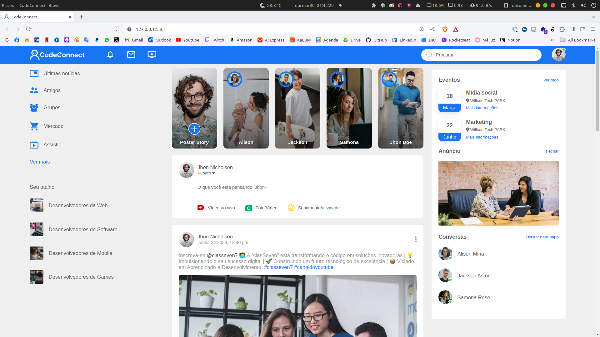

<h1 align="center">
  
  Code Connect
</h1>

  
  
  
  
  

  
  
  

  

## 💻Projeto

**Code connect** - é uma plataforma de rede social para todos os tipos de pessoas que desejam compartilhar conhecimento, experiências e projetos. A plataforma é voltada para desenvolvedores, designers, empreendedores e entusiastas de tecnologia.

**📋Pré-requisitos:**

- HTML5
- CSS3
- JavaScript

**🚀Tecnologias:**

- [VSCode](https://code.visualstudio.com)
- [Git](https://git-scm.com)

**💡Commit:**

- 📦 Create - _Funcionalidades novas_
- 📤 Update - _Atualizações de códigos_
- 🐞 Bug - _Correções de Bugs_
- 🚩 Realese - _Versões do projeto_
